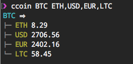

# ccoin [](https://travis-ci.org/crypti/ccoin) [](https://coveralls.io/github/crypti/ccoin?branch=master)

> Convert and fetch the price conversions of cryptocurrencies within your terminal



## Install

```
$ npm install --global ccoin
```

## Usage

```
$ ccoin [from] [to]
```

## API

### ccoin [from] [to]

#### from

Type: `string`<br />

The 3-letter currency symbol you want to *convert from*.

#### to

Type: `string`<br />

A comma-delimited list of the currencies you want to *convert to*.

**Tip:** For a list of 3-letter symbols you can use with this module see [cryptocurrencies](https://github.com/radiovisual/cryptocurrencies).

## Related

[eth-price](https://github.com/crypti/eth-price) - Fetch and compare current ETH price to other currencies/cryptocurrencies in your terminal.

## License

MIT © [Crypti Team](https://github.com/crypti/ccoin)
